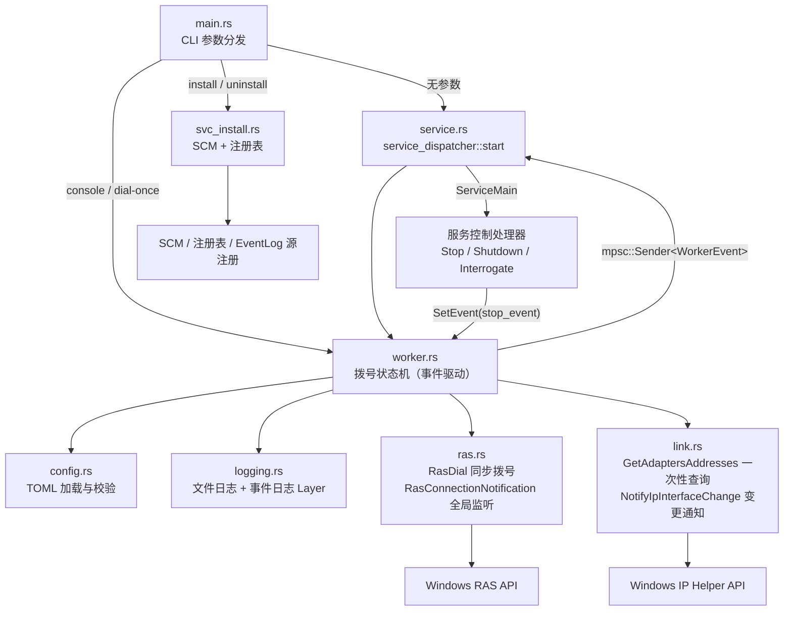
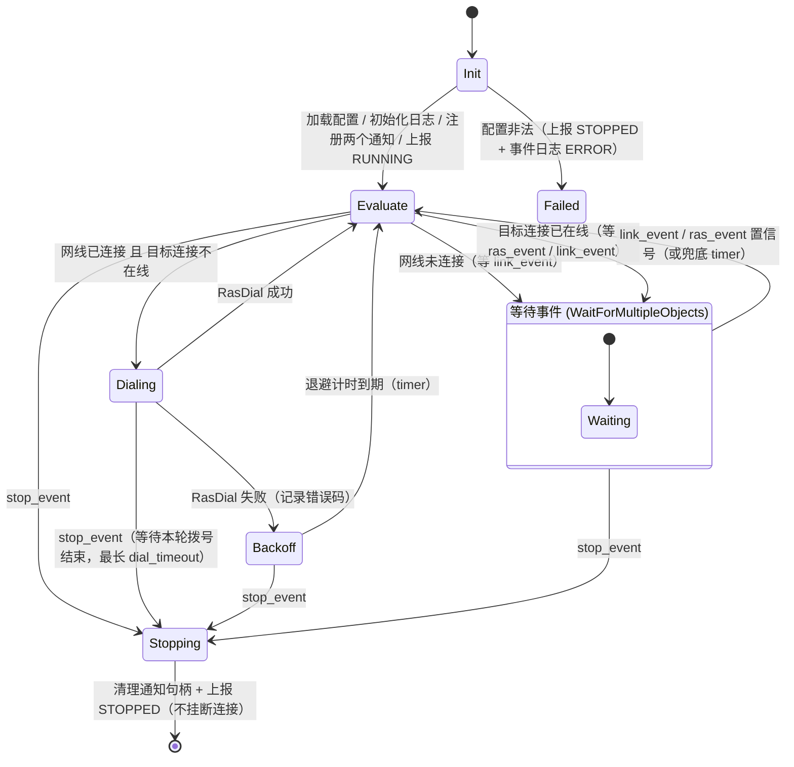
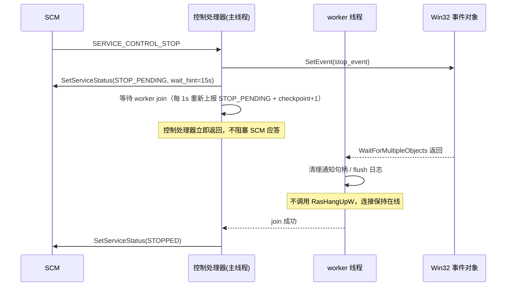

# PPPoE 自动拨号服务 — 设计方案

> 版本：v0.3（已实施，含实机验证结论）
> 目标平台：Windows 10 / 11 / Server 2016+（x64）
> 语言：Rust（edition 2024）
> 状态：**代码已完成，`cargo test` 36 项全通过，`cargo build --release` 零警告，已在实机跑通**

**v0.3 相对 v0.2 的变更（实施阶段根据实机结果修正）**

1. **依赖大幅精简，按「低内存」重选**：去掉 `windows-service`、`tracing*`、`anyhow`、`thiserror`，
   只保留 `windows` + `serde` + `toml`；日志、SCM 服务框架、错误类型全部自研（详见 §4、§9.10）；
2. **源码与终端交互全部英文 ASCII**：所有注释、日志、命令行输出均为 ASCII，
   `console` 模式启动时把控制台代码页切到 UTF-8（65001），避免中文网卡名乱码；
3. **网线检测 API 修正**：`IP_ADAPTER_ADDRESSES` **没有** `MediaConnectState` 字段，
   改用 `GetIfTable2` / `MIB_IF_ROW2`（详见 §8.3）；
4. **实机发现并修复重大误判**：Windows 上几十个 NDIS 过滤层 shim（WFP / Npcap / QoS /
   Hyper-V vSwitch）同样是 `IF_TYPE_ETHERNET_CSMACD` 且报告 `Connected`，
   必须用 `FilterInterface` / `HardwareInterface` 位剔除（详见 §9.10）；
5. **取消 worker→service 的 mpsc 通道**：状态只用于日志，不需要回传，去掉通道进一步减小开销；
6. 事件 ID 简化为按级别映射（`1000` ERROR / `1001` WARN / `1002` INFO / `1003` DEBUG）；
7. **`create_entry_if_missing` 默认改为 `true`**：服务默认按 PPPoE 模板在电话簿中自动补建连接条目，
   做到「填上连接名 + 账号 + 密码即可用」，不再依赖桌面上手工创建的「宽带连接」
   （服务以 LocalSystem 运行，本来就看不到交互式账户的电话簿）。
   同时 `RasGetEntryPropertiesW` 的探测把 `ERROR_BUFFER_TOO_SMALL` 也视为「条目已存在」，
   避免把「存在」误判成「缺失」而反复重建；`dial-once` 也会执行同样的探测/补建。

---

## 1. 项目目标

把现有的一次性拨号 Demo（`src/main.rs`，硬编码账号密码、同步 `RasDialW`、无重试无日志）
改造为一个**可长期稳定运行的 Windows 服务**，实现：

1. 开机自动启动，无人值守运行；
2. 拨号前检测**物理网线是否插入**，未插入则等待，插入才拨号；
3. 拨号前检测**连接当前是否已在线**，已在线则跳过，避免重复拨号；
4. 断线后**自动重拨**，失败按递增退避重试，保持常在线；
5. 全部参数由 **TOML 配置文件**提供，可现场修改；
6. **完善的日志**（文件 + Windows 事件日志），**且永不打印宽带账号与密码**；
7. **事件驱动**：状态变化由系统事件回调唤醒，不做周期性轮询；
8. 提供 `install / uninstall / start / stop / console / dial-once / list-connections` 命令行。

### 1.1 非目标（本期不做）

- 图形界面 / 托盘程序；
- 多连接并发拨号（仅管理 `[dial]` 指定的**一个**连接）；
- 流量统计、限速、代理、转发；
- 自动探测并创建宽带连接（本期只做「配置里给出连接名」，自动建条目为可选增强，见 §9.4）；
- **主动挂断连接**（除 `dial-once` 调试模式外，服务运行期间不会调用 `RasHangUpW`）；
- 跨平台（仅 Windows）。

---

## 2. 需求分解与验收标准

| 编号 | 需求 | 验收标准 |
| --- | --- | --- |
| R1 | 服务化运行 | `pppoe.exe install` 后 `services.msc` 中出现该服务，启动类型=自动；重启机器后服务自动处于「正在运行」 |
| R2 | 网线检测 | 拔掉网线启动服务 → 日志输出「网线未连接，等待事件」且**不发起拨号**；插上网线 → **1 秒内**（事件驱动，非等待检测周期）发起拨号 |
| R3 | 拨号前状态检查 | 已在线时启动服务 → 日志输出「已连接，跳过拨号」，不发生重复拨号（RAS 连接数不增加） |
| R4 | 断线重连 | 手动断开连接（或在路由器侧断开）→ **1 秒内**（事件驱动）检测到掉线并自动重拨成功 |
| R5 | TOML 配置 | 修改 `pppoe.toml` 中的连接名/账号/密码/间隔后重启服务即生效；配置项缺失或非法时给出明确错误并写日志 |
| R6 | 日志 | `logs/pppoe.log.YYYY-MM-DD` 按天生成；事件查看器「应用程序」中出现来源为服务名的条目；**日志全文不出现宽带账号与密码** |
| R7 | 停止不挂断 | `sc stop` 后服务变为「已停止」，且**拨号连接保持在线**；再次 `sc start` 时日志输出「已在线，跳过拨号」 |
| R8 | 异常恢复 | 进程被强杀（`taskkill /F`）后，SCM 依据失败恢复策略自动重启服务；**重启后既有连接仍在线且被正确识别** |
| R9 | 零轮询 | 服务空闲（在线）时，除等待事件外不产生周期性 RAS 查询；无拨号/断线事件时日志保持静默 |
| R10 | 凭据安全 | `grep` 日志目录与事件日志均**查不到**配置中的 `username` / `password` 原文 |
| R11 | 英文/无乱码 | 源码注释、日志、命令行输出全为 ASCII；`console` 模式 `SetConsoleOutputCP(65001)`，中文网卡名不乱码 |
| R12 | 低内存 | 依赖仅 `windows` + `serde` + `toml`；无 tokio / 日志框架 / anyhow；空闲线程阻塞在事件上；release 体积 ≈ 530 KB |
| R13 | 网卡判据正确 | 本机数十个 NDIS 过滤 shim 不得影响网线判定；只有真实网卡（`HardwareInterface`）参与裁决 |

---

## 3. 现状

```
pppoe/
├── Cargo.toml          # windows 0.58（Win32_NetworkManagement_Rras / Win32_Foundation），release: panic=abort
└── src/main.rs         # 硬编码 Dr.com / 账号 / 密码，RasDialW 同步拨号，成功后不挂断
```

现有代码可直接复用的部分：

- `to_wide()` / `copy_to_buf()`：UTF-16 转换与固定长度数组成员复制；
- `RASDIALPARAMSW` 的填充方式（`dwSize = size_of::<RASDIALPARAMSW>()`、数组按字段长度截断）；
- `RasDialW` 的同步调用方式（`dwNotifierType = 0`、`lprasconn = &mut hrasconn`）。

需要改造的部分：硬编码配置、无日志、无重试、无状态检查、无服务化、**无事件通知机制**。

> 注：`src/main.rs` 中当前硬编码的真实账号密码，实施时必须删除（改为从配置文件读取），
> 且不得出现在任何日志输出中。

---

## 4. 技术选型

| 类别 | 选型 | 理由 |
| --- | --- | --- |
| 服务框架 | **自研**（`StartServiceCtrlDispatcherW` / `RegisterServiceCtrlHandlerExW` / `SetServiceStatus`） | 全部加起来约 200 行，反而比引入 `windows-service` 更小；少一个依赖、少一次网络拉取 |
| 系统 API | `windows = "0.58"`（沿用） | features：`Win32_Foundation`、`Win32_NetworkManagement_Rras`、`Win32_NetworkManagement_IpHelper`、`Win32_NetworkManagement_Ndis`、`Win32_Networking_WinSock`、`Win32_Security`、`Win32_System_Console`、`Win32_System_EventLog`、`Win32_System_Registry`、`Win32_System_Services`、`Win32_System_SystemInformation`、`Win32_System_Threading` |
| 配置 | `serde`（derive）+ `toml = "0.8"` | 声明式反序列化，`#[serde(default)]` + `Default` 实现保证新增字段向后兼容 |
| 日志 | **自研** `src/logger.rs`（`Mutex<File>` + 手写按天轮转 + `ReportEventW`） | 无后台线程、无通道、无 subscriber 注册表；关掉的记录只花一次整数比较；顺带实现凭据兜底过滤 |
| 错误处理 | `type Error = Box<dyn std::error::Error + Send + Sync>` | 一行别名即可，无需 `anyhow` / `thiserror` |
| 并发 | 标准库 `std::thread` + Win32 事件对象 | **不引入 tokio**；`WaitForMultipleObjects` 天然支持"零轮询" |

**不引入 tokio 的理由**：核心循环是"等待系统事件 → 评估一次状态 → 必要时拨号"的同步模型，
`RasDialW` 是阻塞调用，Win32 事件对象已经完整覆盖需求；
同步线程模型与 `HRASCONN` 的线程约束也更好推理，避免 Session 0 下的异步运行时复杂度。

**为什么连 `windows-service` 也去掉**：它提供的只是 `ServiceMain` 分发与状态上报封装，
而本项目的「停止不挂断 + 分段续报 `STOP_PENDING`」需要自己控制上报节奏，
手写反而更直接；同时避免在离线/受限环境里为它再拉一个 `windows-sys` 依赖树。

---

## 5. 总体架构

### 5.1 组件视图



### 5.2 线程模型与事件对象

**三个 Win32 事件对象 / 一个通知句柄**：

| 对象 | 类型 | 创建者 | 何时置信号 |
| --- | --- | --- | --- |
| `stop_event` | Manual-reset Event | `service.rs`（`console` 模式下由 `worker` 自建 + Ctrl+C 处理器置位） | 服务收到 `Stop` / `Shutdown`；控制台 Ctrl+C |
| `link_event` | Auto-reset Event | `link.rs` | `NotifyIpInterfaceChange` 回调（网卡新增/删除/状态变更，含网线插拔） |
| `ras_event` | Auto-reset Event | `ras.rs` | `RasConnectionNotificationW` 回调（任意 RAS 连接**创建或终止**） |

| 线程 | 职责 | 说明 |
| --- | --- | --- |
| 主线程 | `service_dispatcher::start` → SCM 调度；控制处理器回调 | 回调只做 `SetEvent(stop_event)` + `SetServiceStatus`，**不做任何阻塞 IO** |
| worker 线程 | 事件驱动状态机：等待事件 → 评估状态 → 必要时拨号 | **独占调用全部 RAS 阻塞 API**（`RasDialW` 会阻塞，配合 watchdog） |
| watchdog 线程（仅拨号期间存在） | 拨号超时保护 | `WaitForSingleObject(dial_done, dial_timeout)` 超时则枚举连接表挂断那次拨号（0.1.2 起不再使用语义未文档化的 `RasHangUpW(NULL)`，见 §9.5.1） |
| 系统回调线程（RAS / IP Helper） | 系统内部线程调用我们的回调 | 回调内**只做 `SetEvent`**，绝不做查询/日志/加锁 |

**关键设计：worker 不持有 `HRASCONN`。**
监听使用 `RasConnectionNotificationW(INVALID_HANDLE_VALUE, ...)`（全局监听模式），
无需保存任何连接句柄，从而彻底规避 `HRASCONN` 非 `Send` 的跨线程问题（见 §9.6）。
句柄只在 `dial-once` 调试模式下短暂持有，用于拨完即挂断。

### 5.3 目录结构

```
pppoe/
├── Cargo.toml                  # 依赖与 windows features（仅 windows + serde + toml）
├── pppoe.toml.example          # 带注释的配置示例（ASCII）
├── README.md                   # 安装 / 配置 / 调试 / 排障说明
├── docs/
│   └── DESIGN.md               # 本文档
└── src/
    ├── main.rs                 # CLI 子命令分发；服务模式下调用 service::run()
    ├── error.rs                # Error/Result 别名 + 错误构造辅助（替代 anyhow）
    ├── config.rs               # 配置结构体 / 加载 / 校验 / 凭据脱敏 / 编码兼容
    ├── logger.rs               # 自研日志：按天轮转 + 事件日志 + 凭据兜底过滤
    ├── link.rs                 # 网卡链路一次性查询（GetIfTable2）+ 接口变更通知
    ├── ras.rs                  # RAS 拨号 / 状态查询 / 全局连接通知 / 错误码映射
    ├── worker.rs               # 事件驱动拨号状态机（WaitForMultipleObjects，零轮询）
    ├── service.rs              # 自研 Windows 服务生命周期（停止不挂断 + STOP_PENDING 续报）
    └── svc_install.rs          # 安装 / 卸载 / 崩溃重启 / 事件源注册
```

---

## 6. 运行流程与状态机

### 6.1 事件驱动状态机



要点：

- **没有"巡检周期"**。状态只在两类时机被重新评估：
  (a) 系统事件（RAS 连接变化 / 网卡变化）；(b) 主动动作（启动、拨号返回、退避到期）。
- `WaitForMultipleObjects` 使用 `INFINITE` 超时（纯事件驱动）；
  仅当配置了兜底选项 `safety_recheck_secs > 0` 时才使用该超时值（见 §9.9）。
- 每次从 `Wait` 回到 `Evaluate` 都会**完整重新评估**（读网卡 → 查 RAS 连接），
  因此对伪唤醒、事件合并天然幂等。

### 6.2 主循环伪代码

```text
// ---- Init ----
let stop_event = CreateEventW(manual_reset = true);        // 服务控制处理器置位
let link_evt   = CreateEventW(manual_reset = false);        // IP 接口变更（自动复位）
let ras_evt    = CreateEventW(manual_reset = false);        // RAS 连接创建/终止（自动复位）

let _ip_guard  = link::notify_guard(AF_UNSPEC, initial = true, link_evt)?;   // NotifyIpInterfaceChange
ras::register_connection_notification(INVALID_HANDLE_VALUE, ras_evt,
                                      RASCN_Connection | RASCN_Disconnection)?;

let mut backoff = Backoff::new(cfg.monitor);

loop {
    if stop_event.is_set() { break }

    // ① 网线检测（一次性查询，非轮询）
    if cfg.link_check.enabled && !link::is_link_up(filter)? {
        info!("网线未连接，等待接口变更事件");
        wait([stop_event, link_evt, ras_evt], safety_timeout);   // 阻塞等待
        continue;
    }

    // ② 拨号前状态检查（一次性枚举，非轮询）
    if ras::is_connected(&cfg.dial.entry_name)? {
        info!("连接 [{}] 已在线，跳过拨号，等待断线事件", entry_name);
        wait([stop_event, link_evt, ras_evt], safety_timeout);
        continue;
    }

    // ③ 拨号
    info!("发起拨号 entry={}", entry_name);
    match ras::dial(&cfg.dial, dial_timeout) {     // 内部带 watchdog 超时打断
        Ok(_conn) => {
            info!("拨号成功");
            backoff.reset();
            // 不保存 _conn；连接由 RasMan 持有，进程退出后依旧在线
            // 回到循环顶部重新评估（会命中 ②，进入等待断线事件）
        }
        Err(e) => {
            let info = ras::describe_error(e.code);
            error!("拨号失败 code={}({})", e.code, info.message);   // 不含账号
            let d = backoff.next_delay();
            info!("{}s 后重试（第 {} 次）", d.as_secs(), backoff.attempts());
            wait([stop_event], d);                  // 退避计时（不是轮询）
            // 退避期间若收到断线/接口事件，也允许提前重试
        }
    }
}

// ---- Stopping ----
// 只做资源清理：关闭事件句柄 / CancelMibChangeNotify2 / flush 日志
// ！！！绝不挂断在线连接 —— 连接必须保持在线（失败/残留的拨号尝试另见 §9.5.1）！！！
drop(_ip_guard);
```

### 6.3 停止（优雅退出）时序



**关键点**：

1. 控制处理器**不阻塞**、不做拨号/网络操作，只 `SetEvent` + 上报状态；
2. 因为存在"停止时不打断拨号"的约束（§9.5），停止最长可能等待
   `dial_timeout_secs`；期间由主线程每 1 秒递增 `checkpoint` 重报 `STOP_PENDING`，
   避免 SCM 依据 `wait_hint` 判定服务无响应；
3. **停止流程不触碰连接**：不调用 `RasHangUpW`，连接在服务停止后继续在线；
   重启服务时会命中"已在线，跳过拨号"分支，不会产生重影连接。

---

## 7. 配置设计（TOML）

### 7.1 文件位置与定位规则

- 默认路径：**exe 同目录**下的 `pppoe.toml`；
  服务运行时 CWD 是 `C:\Windows\System32`，因此**必须**用
  `std::env::current_exe()?.parent()` 定位，**不可**依赖相对路径/CWD。
- 可用 `--config <path>` 覆盖（便于现场把配置放到受控目录）。
- 配置模板：仓库内为 `pppoe.toml.example`（`pppoe.toml` 被 gitignore，因为它装着真实密码）；
  发布包内则以 `pppoe.toml` 之名提供，解压后直接编辑即可。

### 7.2 字段定义

#### `[service]`

| 字段 | 类型 | 默认 | 说明 |
| --- | --- | --- | --- |
| `name` | string | `"PppoeDialer"` | SCM 服务名。**必须与程序中编译期常量 `SERVICE_NAME` 一致**，也与事件日志来源名一致 |
| `display_name` | string | `"PPPoE Auto Dialer"` | 服务显示名 |
| `description` | string | `"自动拨号并保持 PPPoE 连接在线"` | 服务描述 |

#### `[dial]`

| 字段 | 类型 | 默认 | 说明 |
| --- | --- | --- | --- |
| `entry_name` | string | 必填 | 电话簿中的宽带连接名，如 `"Dr.com"`（**连接名不是账号，可以进日志**） |
| `username` | string | 必填 | 宽带账号，**任何日志/事件日志中都不输出** |
| `password` | string | 必填 | 宽带密码，**任何日志/事件日志中都不输出** |
| `pbk_path` | string | `""` | 电话簿路径。空 = 默认；建议显式指定 All Users 电话簿，见 §9.4 |
| `create_entry_if_missing` | bool | **`true`** | 条目不存在时按 PPPoE 模板自动创建（**默认开启**，见 §9.4）。设为 `false` 表示自行管理电话簿 |
| `dial_timeout_secs` | u64 | `90` | 单次拨号等待上限，超时由 watchdog 打断。**注意该值也决定了 `sc stop` 的最坏等待时间** |
| `domain` | string | `""` | 可选，拨号域（PPPoE 通常留空） |

#### `[link_check]`

| 字段 | 类型 | 默认 | 说明 |
| --- | --- | --- | --- |
| `enabled` | bool | `true` | 关闭后跳过网线检测，直接拨号 |
| `adapter_name` | string | `""` | 空 = 任一以太网网卡 Link Up 即认为「已插网线」；非空 = 按网卡 `FriendlyName`/`Description` **子串匹配** |
| `interface_types` | string[] | `["ethernet"]` | 参与判定的接口类型，支持 `ethernet`（`IF_TYPE_ETHERNET_CSMACD`）。保留字段便于将来扩展 |

#### `[monitor]`

| 字段 | 类型 | 默认 | 说明 |
| --- | --- | --- | --- |
| `reconnect_delay_secs` | u64 | `5` | 首次拨号失败后的延迟 |
| `max_backoff_secs` | u64 | `300` | 退避上限 |
| `backoff_jitter_secs` | u64 | `3` | 退避抖动幅度，避免固定节奏 |
| `event_debounce_ms` | u64 | `500` | 事件合并窗口：窗口内的多个通知只触发一次状态评估，避免通知风暴 |
| `safety_recheck_secs` | u64 | `0` | **兜底定时器**，`0` = 关闭（纯事件驱动，默认）。>0 时在无事件期间额外唤醒一次做保险性复检，用于对抗极端情况下通知丢失 |

> **v0.2 已移除 `check_interval_secs`**：网线检测与在线巡检不再周期轮询，
> 改由 `link_event` / `ras_event` 驱动。仅保留可选的 `safety_recheck_secs` 作为保险。

#### `[log]`

| 字段 | 类型 | 默认 | 说明 |
| --- | --- | --- | --- |
| `dir` | string | `"logs"` | 日志目录，**相对于 exe 目录**；支持绝对路径 |
| `level` | string | `"info"` | `error` \| `warn` \| `info` \| `debug` \| `trace` |
| `rotation` | string | `"daily"` | `daily`（按天）\| `never`（单文件） |
| `max_files` | usize | `14` | 启动时**以及每次按天轮转时**清理超过该数量的历史日志文件（`0` = 不清理） |
| `event_log` | bool | `true` | 是否同时写 Windows 事件日志 |

### 7.3 示例（`pppoe.toml.example`）

见仓库根目录同名文件，已带逐行注释。

### 7.4 校验规则

加载后立即 `Config::validate()`，任一失败则以 `ERROR` 写日志 + stderr 输出，服务拒绝启动（避免带病运行）：

- `dial.entry_name` / `dial.username` / `dial.password` 非空；
- `service.name` 非空且不含 `\` `/`；
- `log.level` 是合法级别枚举，`log.rotation` 是 `daily|never`；
- `reconnect_delay_secs >= 1`，`max_backoff_secs >= reconnect_delay_secs`；
- `dial_timeout_secs >= 10`；
- `safety_recheck_secs == 0 || safety_recheck_secs >= 30`（避免退化成高频轮询）；
- `link_check.interface_types` 中每项都能映射到已知类型。

> 校验失败的报错文案中**只提及字段名**，不回显字段值，避免账号/密码泄漏到日志。

### 7.5 凭据安全（v0.2 强化）

| 措施 | 说明 |
| --- | --- |
| 日志禁印 | `Config` 不实现 `Display`/`Debug` 派生输出凭据；统一通过 `Config::redacted()` / `DialConfig::redacted()` 生成摘要，`username` 与 `password` **均为 `***`** |
| 事件日志禁印 | 事件日志写入的消息文本与文件日志同源，天然继承脱敏；`EventLogLayer` 内再做一次兜底校验（命中凭据正则则丢弃该条并写 WARN，仅提示"疑似凭据泄漏，已丢弃"） |
| 错误链禁印 | `anyhow` 上下文只带**字段名/错误码/连接名**，绝不带账号密码；`RasDialW` 返回的错误码本身不回显输入 |
| 调试输出禁印 | `debug`/`trace` 级别同样禁止；代码评审检查点：全局搜索 `username` / `password` 的格式化用法，只允许出现在 `RasDialW` 的参数填充与配置文件解析中 |
| 文件 ACL | 配置含明文密码，README 要求收紧权限（见 §11.1） |

---

## 8. 模块设计

### 8.1 `config.rs`

```rust
#[derive(Clone, Deserialize, Default)]        // 不派生 Debug，避免误打出凭据
#[serde(default)]                             // 缺字段用 Default 兜底（容器级 default）
pub struct Config { pub service: ServiceConfig, pub dial: DialConfig,
                   pub link_check: LinkCheckConfig, pub monitor: MonitorConfig,
                   pub log: LogConfig }

impl Config {
    /// path=None 时按 exe 同目录定位 pppoe.toml
    pub fn resolve_path(explicit: Option<&Path>) -> Result<PathBuf>;
    pub fn load(explicit: Option<&Path>) -> Result<Loaded>;   // Loaded { config, path }
    pub fn from_toml_str(text: &str) -> Result<Config>;
    pub fn validate(&self) -> Result<()>;
    pub fn summary(&self) -> String;                 // username/password → ***
    pub fn secrets(&self) -> Vec<String>;            // 交给 logger 做兜底过滤
    pub fn level(&self) -> Level;
    pub fn rotation(&self) -> Rotation;
    pub fn interface_types(&self) -> Result<Vec<u32>>;
    pub fn log_dir(&self) -> Result<PathBuf>;        // 相对路径 → exe 目录
}

pub fn exe_dir() -> Result<PathBuf>;
pub fn config_arg(args: &[String]) -> Option<PathBuf>;   // --config / --config=
```

- 每个子结构体 `#[derive(Clone, Deserialize)] + #[serde(default)] + impl Default`：
  新增字段自动向后兼容，旧配置文件无需改动；
- **不派生 `Debug`/`Display`**（避免误用 `{:?}` 打出凭据），需要打印时统一走 `summary()`；
- **编码兼容**：`decode()` 自动识别 UTF-8、UTF-8 BOM、UTF-16LE、UTF-16BE，
  避免「用记事本保存后服务起不来」这类问题（有用例覆盖）。

### 8.2 `logger.rs`（自研，无第三方日志依赖）

```rust
pub enum Level { Error, Warn, Info, Debug, Trace }      // Ord：越小越严重
pub enum Rotation { Daily, Never }

pub struct Settings<'a> {
    pub level: Level, pub dir: &'a Path, pub file_name: &'a str,
    pub rotation: Rotation, pub max_files: usize, pub console: bool,
    pub event_log: bool, pub source_name: &'a str, pub secrets: &'a [String],
}

pub fn init(settings: Settings<'_>) -> Result<()>;   // 幂等
pub fn shutdown();                                   // DeregisterEventSource
pub fn is_initialized() -> bool;
pub fn enabled(level: Level) -> bool;
pub fn write(level: Level, target: &str, args: fmt::Arguments<'_>);
pub fn event(level: Level, event_id: u32, target: &str, args: fmt::Arguments<'_>);

// 宏：logger::log_error! / log_warn! / log_info! / log_debug!
// 宏先判断 enabled()，关掉的记录连 format_args! 都不会被求值。
```

实现要点：

1. **无后台线程**：全局 `OnceLock<Logger>`，内部只有一个 `Mutex<Sink>`，
   `Sink` 持有 `Option<File>`；每条记录 `write_all` + `flush`，不引入 `BufWriter`，
   内存占用恒定，且进程被强杀时已写内容不会丢。
   事件源句柄存成 `usize`（`HANDLE` 是裸指针、不是 `Send`），使 `Logger: Send + Sync` 成立。
2. **按天轮转 + 数量上限**：文件名 `pppoe.log.YYYY-MM-DD`（`rotation = "never"` 时为 `pppoe.log`）——
   **`never` 等于放弃数量上限**，因为裁剪只对多个文件有意义；
   写记录时用 `GetLocalTime()` 判断是否跨天并重新打开文件；
   `init` 时扫描目录、按修改时间保留最新 `max_files` 个、删除其余。
3. **凭据兜底过滤（关键安全网）**：每条记录在写往**任何** sink 之前，
   用配置中的 `username`/`password` 做普通 `contains` 替换（`***`），
   命中时额外写一条 WARN 说明「已屏蔽」但**不包含原文**。
   为避免误伤正常文本，长度 < 3 的凭据不参与替换（且程序本身从不格式化凭据）。
4. **事件日志**：`RegisterEventSourceW(None, service_name)` + `ReportEventW`，
   完整消息放进第一个 insertion string（即使没有消息表，事件查看器也能看到全文）；
   只下发 `Info` 及以上（`DEBUG/TRACE` 不刷事件日志）；
   安装时写入的 `EventMessageFile = %SystemRoot%\System32\EventCreate.exe` 消除「找不到描述」。
5. **事件 ID**：按级别映射 `1000 + level`（1000 ERROR / 1001 WARN / 1002 INFO / 1003 DEBUG），
   生命周期事件用 `logger::event()` 显式指定。

### 8.3 `link.rs`（查询 + 变更通知）

```rust
pub enum MediaState { Connected, Disconnected, Unknown }

pub struct AdapterInfo {
    pub alias: String, pub description: String, pub if_type: u32,
    pub oper_up: bool, pub media: MediaState,
    pub hardware: bool,          // HardwareInterface 位：真实网卡
    pub is_filter: bool,         // FilterInterface 位：NDIS 过滤层 shim
    pub connector_present: bool, // ConnectorPresent 位
}

pub struct LinkStatus {
    pub up: bool, pub fallback: bool, pub reason: String,
    pub decided_by: Option<AdapterInfo>, pub adapters: Vec<AdapterInfo>,
}

pub fn snapshot(if_types: &[u32]) -> Result<Vec<AdapterInfo>>;
pub fn snapshot_all() -> Result<Vec<AdapterInfo>>;         // list-adapters
pub fn check(if_types: &[u32], filter: &str) -> Result<LinkStatus>;

pub struct IpChangeGuard { /* NotifyIpInterfaceChange 句柄 */ }
impl Drop for IpChangeGuard { /* CancelMibChangeNotify2 */ }
pub fn notify(event: HANDLE, initial: bool) -> Result<IpChangeGuard>;

pub fn wide_to_string(buffer: &[u16]) -> String;
pub fn describe(adapters: &[AdapterInfo]) -> String;
pub fn describe_candidates(adapters: &[AdapterInfo]) -> String;  // 只描述非 shim 行
```

实现要点：

1. **通知注册**：`NotifyIpInterfaceChange(AF_UNSPEC, Some(cb), ctx, BOOLEAN::from(initial), &mut handle)`，
   `ctx` 传入 `link_event` 的 `HANDLE`（`*const c_void`）；`initial = true` 会立即回调一次，
   相当于免费获得一次"启动即评估"，无需额外轮询。
   `IpChangeGuard::drop` 调用 `CancelMibChangeNotify2(handle)`，
   且必须在关闭事件句柄**之前** drop（否则回调可能给已释放的句柄 `SetEvent`）。
2. **回调契约**：系统线程调用，**只允许** `SetEvent(caller as HANDLE)` 一个动作；
   不做查询、不写日志、不获取锁（避免阻塞系统通知线程）。
   `notification_type` 一律忽略，由 worker 的统一评估逻辑处理。
3. **一次性查询（`GetIfTable2` / `MIB_IF_ROW2`，v0.3 修正）**：
   > ⚠️ 原设计写的是 `GetAdaptersAddresses`，但它**根本没有 `MediaConnectState` 字段**
   > （该字段属于 `MIB_IF_ROW2`）。实施时改为 `GetIfTable2`：
   - `GetIfTable2(&mut table)` 返回整张表，用完必须 `FreeMibTable(table)`；
   - 表结构是柔性数组（`NumEntries` + `Table: [MIB_IF_ROW2; 1]`），
     用 `slice::from_raw_parts((*table).Table.as_ptr(), NumEntries)` 遍历；
   - `Type == IF_TYPE_ETHERNET_CSMACD`（6）过滤接口类型；
   - **链路判定**：`OperStatus == IfOperStatusUp` 且 `MediaConnectState == MediaConnectStateConnected`
     （`NET_IF_MEDIA_CONNECT_STATE`，来自 `Win32_NetworkManagement_Ndis`）；
   - `adapter_filter` 非空时，比较 `Alias`（友好名）或 `Description` 的子串（大小写不敏感）；
   - `MediaConnectState == Unknown`（部分无线/虚拟网卡驱动返回）时**不作为网线判定依据**；
     若剩余接口**全部**为 `Unknown`，则退化为按 `OperStatus` 判断，
     并在日志里以 `WARN` 标注 fallback，避免特殊驱动导致服务永远不拨号。
4. **接口筛选（v0.3 新增，实机发现的重大误判）**：
   - 先剔除 `FilterInterface == 1` 的行（WFP / Npcap / QoS / Hyper-V vSwitch 等 shim，
     本机实测有 20+ 个，且**全部报告 `Connected`**）；
   - 再优先保留 `HardwareInterface == 1` 的真实网卡；
   - 最后才用 `adapter_name` 子串过滤。
   详见 §9.10。
5. **为什么不轮询**：`NotifyIpInterfaceChange` 在接口新增/删除/参数变更（含 `OperStatus`、
   媒体连接状态变化）时都会回调，网线插拔会命中；`check` 只在"被唤醒后"调用一次。
   日志只打印**候选**接口（`describe_candidates`），避免把 30+ 个 shim 灌进每条记录。

### 8.4 `ras.rs`（拨号 + 状态查询 + 连接通知）

```rust
pub struct ConnectionInfo { pub entry: String, pub state: u32, pub connected: bool, pub device: String }
pub struct ErrorInfo { pub code: u32, pub message: &'static str, pub retryable: bool }

/// 携带 RAS 错误码的错误，便于 worker 决定「重试」还是「提示配置问题」
pub struct RasFailure { pub code: u32, pub context: &'static str }
pub fn error_code(err: &Error) -> Option<u32>;

/// 注册全局 RAS 连接通知：任意 RAS 连接创建/终止时置信号 ras_event
pub fn register_connection_notification(event: HANDLE) -> Result<()>;

/// 同步拨号（阻塞）；句柄仅 dial-once 会用，且不跨线程
pub fn dial(cfg: &DialConfig, timeout: Duration) -> Result<Dialed>;
impl Dialed { pub fn hang_up(self) -> Result<()>; }   // 仅供 dial-once

/// 一次性枚举：目标连接是否处于 Connected 状态（事件唤醒后调用，不做周期轮询）
pub fn is_connected(entry_name: &str) -> Result<bool>;
pub fn list_connections() -> Result<Vec<ConnectionInfo>>;
pub fn describe_error(code: u32) -> ErrorInfo;
pub fn ensure_entry(cfg: &DialConfig) -> Result<bool>;   // 可选：自动建条目，true=新建了
pub fn to_wide(text: &str) -> Vec<u16>;
```

实现要点：

1. **复用 Demo 逻辑**：`to_wide` / `copy_to_buf` 抽为模块私有函数；
   `RASDIALPARAMSW.dwSize = size_of::<RASDIALPARAMSW>() as u32`；
   数组复制按目标 `len()` 截断（`szEntryName[257]`、`szUserName[257]`、`szPassword[257]`、`szDomain[16]`），
   保证 NUL 结尾。
2. **连接通知（v0.2 核心）**：
   - 调用 `RasConnectionNotificationW(INVALID_HANDLE_VALUE, ras_event,
     RASCN_Connection | RASCN_Disconnection)`；
   - `INVALID_HANDLE_VALUE`（全局模式）表示**监听本机所有 RAS 连接的创建与终止**，
     因此我们**不需要持有 `HRASCONN`**，也不需要"每次拨号后重新注册"；
   - 事件置信号后，回调线程/worker 通过 `RasEnumConnectionsW` 获取**具体是哪个连接**发生了变化
     （官方文档明确要求：事件本身不带详情，需再查询）；
   - ⚠️ 该 API **没有公开的注销函数**。因此设计上采取"**进程生命周期内只注册一次**"的策略：
     单个事件对象 + 单次注册，随进程退出而释放；不做"每轮拨号后重新注册"，
     避免注册泄漏（`console` 模式也复用同一约束）。
   - 已核实 `windows = 0.58` 导出的常量名与数值：
     `RASCN_Connection = 1u32`、`RASCN_Disconnection = 2u32`；
     `INVALID_HANDLE_VALUE` 用 `HRASCONN(usize::MAX as *mut c_void)` 构造。
3. **状态查询（`is_connected`）**：仅在"被事件唤醒"或"刚拨号返回"时调用：
   - `RasEnumConnectionsW`：首元素 `dwSize` 必须初始化；
     缓冲不足时按返回的 `lpcb` 扩容重试（`ERROR_BUFFER_TOO_SMALL`，603），**不要**假设一次成功；
   - 遍历 `RASCONNW.szEntryName`（`[u16; 257]`）与目标 `entry_name` 比较；
   - 命中后再用 `RasGetConnectStatusW` 判断 `dwState == RASCS_Connected`（`RASCN_Connected`）；
   - 返回「是否存在处于 Connected 状态的目标条目」。
4. **拨号超时（watchdog）**：`RasDialW` 同步模式无超时参数。
   `dial()` 内创建一个 `dial_done` 事件（auto-reset）+ 一次性 watchdog 线程：
   `WaitForSingleObject(dial_done, timeout)`；超时则**枚举连接表并挂断该条目那次未连接的拨号**
   （0.1.2 变更：原先给 `RasHangUpW` 传 NULL 句柄打断，但该语义并未出现在官方文档中，见 §9.5.1）。
   **watchdog 不订阅 `stop_event`**：服务停止时**不打断**正在进行的拨号（§9.5）。
5. **`HRASCONN` 的线程约束**：底层是裸指针，**不是 `Send`**。
   `Dialed` 结构体因此不可跨线程移动；`dial()` 必须在 worker 线程内调用；
   服务模式下**拿到后立即丢弃句柄**（连接由 RasMan 持有，进程退出后依然在线），
   从而不在 worker 之外暴露任何句柄依赖。
6. **错误码映射**：见 §10.2，返回「中文说明 + 是否可重试」，供 worker 决定退避策略与日志级别。
7. **凭据约束**：`dial()` 内部构造 `RASDIALPARAMSW` 时使用 `username`/`password`，
   但**不得**把 `params` 整体格式化输出；所有错误分支只输出 `code` 与 `entry_name`。

### 8.5 `worker.rs`

```rust
pub fn run(cfg: Arc<Config>, stop: HANDLE) -> Result<()>;
pub fn spawn(cfg: Arc<Config>, stop_raw: isize) -> Result<JoinHandle<Result<()>>>;
pub fn dial_once(cfg: &Config, hang_up: bool) -> Result<()>;
pub fn create_event(manual_reset: bool) -> Result<HANDLE>;

pub struct Backoff { /* base / max / jitter / attempts / xorshift seed */ }
impl Backoff {
    pub fn new(cfg: &MonitorConfig) -> Self;
    pub fn attempts(&self) -> u32;
    pub fn reset(&mut self);
    pub fn next_delay(&mut self) -> Duration;   // base * 2^(n-1)，封顶 + ±jitter
}
```

- **没有状态回传通道（v0.3 简化）**：worker 的状态只用于日志，service 只需要
  `RUNNING → STOPPED`，因此去掉了设计中的 `mpsc::Sender<WorkerEvent>`，
  少一条通道、少一份缓冲；
- `Waiter` 封装三个句柄与
  `WaitForMultipleObjects([stop, link, ras], wait_all = BOOL::from(false), timeout)`；
  **`stop` 必须排第一个**，因为该 API 返回最小索引，停止请求永远优先；
- **超时值**：`safety_recheck_secs == 0` → `INFINITE`（纯事件驱动）；否则用该值，
  超时唤醒时在 debug 日志中标注为"兜底复检"；
- **退避等待复用同一个等待函数**（`timeout = backoff.delay`），并且同时监听 `link/ras` 事件，
  使"退避期间网线恢复 / 连接发生变化"能提前触发重试；
- **事件去抖**：被唤醒后先用 `event_debounce_ms` 窗口吞掉这一批通知（拔一次网线会产生多条接口更新），
  然后才做一次完整评估；窗口内若收到 `stop` 立即返回；
- `WaitForMultipleObjects` 失败时记 WARN 并 sleep 1s，绝不空转；
- 栈大小：worker 256 KiB，拨号看门狗 128 KiB；
- 所有日志都不含凭据；全模块不使用 `unwrap()`；
- 停止时顺序为：`drop(ip_guard)` → `CloseHandle(link_event/ras_event)` → 记日志
  「worker stopped; the broadband connection is left online (RasHangUp is never called)」。

### 8.6 `service.rs`（自研 SCM 集成）

```rust
pub const SERVICE_NAME: &str = "PppoeDialer";   // 编译期常量

pub fn run() -> Result<()>;                     // StartServiceCtrlDispatcherW（阻塞到服务结束）

extern "system" fn service_main(argc: u32, argv: *mut PWSTR);
extern "system" fn control_handler(control: u32, evt_type: u32,
                                  evt_data: *mut c_void, ctx: *mut c_void) -> u32;

static STOP_EVENT: AtomicIsize;      // HANDLE 存成 isize，回调与 worker 共享
static STATUS_HANDLE: AtomicIsize;
static CURRENT_STATE: AtomicU32;
static STOP_REQUESTED: AtomicBool;
fn report(state: u32, checkpoint: u32, wait_hint: u32);
```

- `SERVICE_NAME` 为**编译期常量**（SCM 要求启动时即确定）。
  与 `[service].name` 的一致性由 `install` 命令校验：以常量为准注册，配置不一致则直接报错，
  避免装出两个名字不同的服务；
- `run()` 先 `FreeConsole()`：本程序是 console 子系统（命令行要能打印），
  被 SCM 拉起时会把 session 0 里那个隐藏控制台释放掉；
- `service_main` 顺序：
  1. 创建 `stop_event`（manual-reset，必须先于控制处理器注册，否则处理器的 `SetEvent` 会落空）；
  2. `RegisterServiceCtrlHandlerExW` 注册控制处理器；
  3. **立刻**上报 `START_PENDING`（`wait_hint = 10s`）；
  4. 解析 SCM 传入的 argv（`--config` 可用）→ 加载配置；
     失败时**先用 `Config::default()` 初始化一次日志**，再写 `ERROR` + 事件日志，然后上报 `STOPPED` 返回
     —— 否则失败原因无处可查；
  5. 用真实配置初始化日志 → 打印配置摘要（凭据为 `***`）→ 上报 `RUNNING` + 事件日志「started」；
  6. `worker::spawn(Arc::new(config), stop_event.0 as isize)`（句柄以裸值传入，因为 `HANDLE` 不是 `Send`）；
  7. **停止编排**：`while !handle.is_finished() { sleep(1s); if STOP_REQUESTED { checkpoint += 1;
     report(STOP_PENDING, checkpoint, 15s) } }`，然后 `join`；
     由于停止不打断拨号，最坏等待 `dial_timeout_secs`，续报保证 SCM 不会判无响应；
  8. **不调用 `RasHangUpW`**；日志写「service stopped; the broadband connection was left online by design」；
  9. `report(STOPPED)` → `CloseHandle(stop_event)` → `logger::shutdown()`。
- `control_handler`（SCM 自己的线程调用，必须秒回）：
  - `SERVICE_CONTROL_STOP | SERVICE_CONTROL_SHUTDOWN` → 置 `STOP_REQUESTED`、
    上报 `STOP_PENDING`、`SetEvent(STOP_EVENT)`，返回 0；
  - `SERVICE_CONTROL_INTERROGATE` → 用 `CURRENT_STATE` 原样回报，返回 0；
  - 其他 → `ERROR_CALL_NOT_IMPLEMENTED (120)`。
  - `dwControlsAccepted` 只在 `RUNNING` 时为 `SERVICE_ACCEPT_STOP | SERVICE_ACCEPT_SHUTDOWN`，
    其余状态为 0。

### 8.7 `svc_install.rs`

```rust
pub fn service_name(config: &Config) -> Result<String>;   // 与 SERVICE_NAME 比对
pub fn install(config: &Config) -> Result<()>;
pub fn uninstall(config: &Config) -> Result<()>;
pub fn start(config: &Config) -> Result<()>;
pub fn stop(config: &Config) -> Result<()>;
pub fn query(config: &Config) -> Result<()>;

fn win32_code(error: &windows::core::Error) -> u32;       // HRESULT_FROM_WIN32 → 低 16 位
```

> `windows` crate 把 Win32 失败包装成 `HRESULT_FROM_WIN32`（facility 7），
> 所以判断 `ERROR_SERVICE_EXISTS (1073)` 之类必须先取低 16 位，否则永远匹配不上。
> 这是一处容易写错、但实测必须处理的细节（`WinError::code().0 as u32 & 0xFFFF`）。

`install` 步骤：

1. `OpenSCManagerW(None, None, SC_MANAGER_ALL_ACCESS)`（需管理员权限，否则返回 `ERROR_ACCESS_DENIED(5)` 并提示）；
2. `CreateServiceW`：
   - `dwServiceType = SERVICE_WIN32_OWN_PROCESS`；
   - `dwStartType = SERVICE_AUTO_START`（**开机自启动**）；
   - `dwErrorControl = SERVICE_ERROR_NORMAL`；
   - `lpBinaryPathName = "<exe 绝对路径>"`（**必须绝对路径**，服务不能依赖 CWD）；
   - `lpDependencies = L"RasMan\0\0"`（保证 RAS 管理器先于本服务就绪；若现场 RasMan 被禁用需提示）；
3. `ChangeServiceConfig2W(SERVICE_CONFIG_DESCRIPTION)` 写入 `[service].description`；
4. `ChangeServiceConfig2W(SERVICE_CONFIG_FAILURE_ACTIONS)` 配置崩溃自动重启：
   `RESET_PERIOD = 86400`，动作序列 `[RESTART(5000), RESTART(10000), RESTART(30000)]`
   （配合 `panic = "abort"`，进程异常终止后 5s 内由 SCM 拉起；
   连接由 RasMan 持有，重启后仍在线，会被"已在线"分支正确识别）；
5. 注册事件日志来源：创建注册表键
   `HKLM\SYSTEM\CurrentControlSet\Services\EventLog\Application\<service.name>`，
   值 `EventMessageFile = %SystemRoot%\System32\EventCreate.exe`、`TypesSupported = 0x07`，
   使事件查看器能正常显示条目而不报「找不到描述」；
   （进阶可选：用 `mc.exe` 编译消息表并填写自有 DLL/EXE 路径以显示本地化描述。）
6. 打印后续操作提示（`sc start <name>` / 配置 ACL / 放置 `pppoe.toml`）。

`uninstall`：先 `ControlService(STOP)`（失败忽略）→ 轮询等待停止
（`QueryServiceStatus` 是 SCM 状态轮询，与"拨号状态轮询"无关，且必须等待服务真正退出才能删配置）
→ `DeleteServiceW` → 删除事件源注册表键。

---

## 9. 关键技术决策与权衡

### 9.1 原生服务 vs 第三方包装

选**原生服务**（`windows-service`）。NSSM/WinSW 需要额外分发第三方 exe，
而本需求对「单文件 + 开机自启 + 崩溃自动重启」的要求，SCM 原生能力已完全覆盖。

### 9.2 事件驱动 vs 周期轮询（v0.2 核心变更）

| 维度 | 轮询（v0.1 方案） | 事件驱动（v0.2 方案） |
| --- | --- | --- |
| 断线感知延迟 | 最坏 1 个巡检周期（默认 15s） | 通常 < 1s |
| 网线插拔感知延迟 | 最坏 1 个检测周期 | 通常 < 1s |
| CPU/唤醒 | 周期唤醒 + 每次 `RasEnumConnectionsW` | 空闲时线程完全阻塞在 `WaitForMultipleObjects`，零唤醒 |
| 日志噪声 | 每周期需产出 debug 日志 | 无事件时完全静默 |
| 复杂度 | 低 | 中（需管理事件句柄生命周期与回调契约） |
| 风险 | — | 依赖系统通知不丢（见 §9.9 兜底） |

本方案采用事件驱动：
`RasConnectionNotificationW`（RAS 连接创建/终止）+ `NotifyIpInterfaceChange`（网卡/链路变化），
`WaitForMultipleObjects` 统一阻塞等待；仅在**被唤醒后**调用一次性的
`GetAdaptersAddresses` / `RasEnumConnectionsW` 做状态评估。

### 9.3 网线检测用 `GetAdaptersAddresses` 而非尝试拨号

能区分「没插网线」与「认证失败」，避免无意义的拨号尝试与日志噪声；
配合 `NotifyIpInterfaceChange`，插拔网线可被即时感知，且**不需要周期性查询**。

### 9.4 「服务账户找不到宽带连接」——本项目最大的落地风险

`RasDialW` 的第二个参数传 `NULL` 时，使用的是**调用进程所属帐户**的电话簿。
服务默认以 `LocalSystem` 运行，其电话簿位于
`C:\Windows\System32\config\systemprofile\AppData\Roaming\Microsoft\Network\Connections\Pbk\rasphone.pbk`，
**通常不含**你在桌面「网络和共享中心」里创建的宽带连接 —— 表现为拨号立刻失败（多为 `623/691/651`）。

对策（**C 已实现为默认**）：

| 方案 | 做法 | 优点 | 缺点 |
| --- | --- | --- | --- |
| **C. 程序自动补建条目**（✅ **默认**，`create_entry_if_missing = true`） | 启动时 `RasGetEntryPropertiesW` 探测，缺失则用 `RasSetEntryPropertiesW` 按 PPPoE 模板写入（字段见下） | **完全自包含**：配置里填连接名+账号+密码即可，不需要预先在桌面上建「宽带连接」 | 模板字段需要正确（否则会建出一个拨不通的条目）；若要复刻 GUI 里的高级参数（脚本、加密、认证限制等）则应改用 A 方案 |
| **A. 使用 All Users 电话簿** | 把宽带连接创建为「允许其他人使用此连接」，条目写入 `C:\ProgramData\Microsoft\Network\Connections\Pbk\rasphone.pbk`；配置 `pbk_path` 显式指向该文件，并设 `create_entry_if_missing = false` | 复用 GUI 里调好的连接项（脚本、高级参数等） | 需重新创建连接项（或在 GUI 中勾选共享） |
| **B. 让服务以指定用户运行** | `sc config <name> obj= ".\user" password= "xxx"` | 直接复用该用户自己的电话簿 | 依赖用户密码，改密后服务起不来；需要「作为服务登录」权限 |

#### C 方案写入的字段（`ras::ensure_entry`，已与实机 GUI 条目逐项对齐）

```text
dwType            = RASET_Broadband (5)        -> pbk: Type=5      [曾误用 RASET_Phone(1)]
dwfNetProtocols   = RASNP_Ip (4)               -> pbk: 仅 IPv4
dwFramingProtocol = RASFP_Ppp (1)              -> PPP 封装
dwfOptions        = RASEO_RemoteDefaultGateway -> pbk: IpPrioritizeRemote=1
                    （RASEO_DisableLcpExtensions(32) 保持清零 = LCP 扩展启用 -> pbk: LcpExtensions=1）
szDeviceType      = "PPPoE"                    -> pbk: DEVICE=PPPoE
szDeviceName      = "WAN Miniport (PPPOE)"     -> pbk: Device/PreferredDevice
dwCountryID/Code  = 1 / 1
```

两处容易搞反、已写进代码注释的地方：

1. **`dwType` 必须是 `RASET_Broadband(5)`**：本机用 GUI 建的 `Dr.COM` 在 pbk 里就是
   `Type=5` + `DEVICE=PPPoE`；`RASET_Phone(1)` 会生成一个"拨号电话"式的条目。
2. **LCP 扩展的标志是反向的**：pbk 里的 `LcpExtensions=1` 表示**启用**，
   而 API 侧对应的却是 `RASEO_DisableLcpExtensions`。
   所以"启用 LCP 扩展"= **不设**该位（零初始化的 `RASENTRYW` 天然满足），
   代码里刻意把它留空并加了注释说明，避免以后有人"顺手补上"而把 LCP 关掉。

另外刻意**不**打开的开关：`RASEO_IpHeaderCompression` / `RASEO_SwCompression`
（PPPoE 传的是整帧，压缩无意义，个别 BRAS 还会因此协商失败）、
`RASEO_SpecificIpAddr`（保持服务器分配 IP）、
`RASEO_UseLogonCredentials`（凭据由 `RasDialW` 显式传入）。

> 采用 C 之后的实施顺序：`install` → 填 `pppoe.toml` → `sc start`。
> 首次启动的日志里会看到 `created the phone book entry "Dr.COM"`，
> 之后每次启动是 `phone book entry "Dr.COM" already exists`。
> 若想确认服务侧"看到"了什么条目，用 `pppoe.exe list-connections`（会枚举真实连接）
> 或把 `log.level` 调到 `debug` 看 `RasGetEntryPropertiesW` 的结果。

### 9.5 停止服务不挂断连接（v0.2 变更）

**要求**：`sc stop` 之后连接必须保持在线。

设计后果：

1. 停止路径**彻底移除** `RasHangUpW`；
2. 连接由 `RasMan` 服务持有，进程退出不会拆除连接 —— 这正是"遗留连接"的成因，
   在本需求中该特性被**主动利用**；
3. 重启服务（或 SCM 崩溃重启）时，`RasEnumConnectionsW` 能查到该连接 →
   走"已在线，跳过拨号"分支，不会产生重影连接；
4. **副作用 / 代价**：服务停止时若正卡在 `RasDialW`，不能强行打断
   （强行打断可能误杀刚建立成功的连接），因此：
   - 停止最长等待时间为 `dial_timeout_secs`（默认 90s，建议 60~120）；
   - 主线程需周期性重报 `STOP_PENDING` 以避免 SCM 判无响应（§8.6 第 5 步）；
   - 控制处理器**不订阅** `stop_event` 到 watchdog 的等待集合中。

#### 9.5.1 失败与残留的拨号必须挂断（0.1.2 变更）

§9.5 的"不挂断"只针对**在线连接**。2026-09-17 的一次真实故障说明这条规则曾被理解得过宽：

- `RasDialW` **失败时也会回填一个非 NULL 的连接句柄**，官方文档要求
  "即使 `RasDial` 返回非零（错误）值"也必须对该句柄调用 `RasHangUp`（见 `RasDial` 文档 Remarks）。
  旧实现把句柄直接丢弃 → 拨号被中途打断（典型诱因：**拨号过程中网线被拔**）后，
  `PPPoE5-0` 端口停在半开状态；
- 此后每次拨号都被 `756 ERROR_DIAL_ALREADY_IN_PROGRESS`（中文界面提示
  "指定的端口已经打开"）秒拒，而该状态**属于 `RasMan` 而不是本进程**：
  停止服务、卸载服务都无法释放，只能重启 `RasMan`、复位 PPPoE 设备或重启机器；
- 实测：46 次重试、持续 1 小时 50 分无法自愈；期间 `RasEnumConnectionsW` 的**连接表是空的**，
  `WAN Miniport (PPPOE)` 设备状态正常 —— 也就是说这个故障在"连接层"和"驱动层"都是隐形的。

因此 0.1.2 起：

| 路径 | 行为 |
| --- | --- |
| 拨号失败（含 651 这类中途失败） | 对返回的非 NULL 句柄调用 `hang_up_and_wait()` |
| 挂断之后 | 轮询 `RasGetConnectStatusW` 直到句柄失效（上限 5s），确认端口真正释放后才允许重试 |
| 拨号返回 756 | 枚举连接表，挂断"同条目且 `connected == false`"的连接；成功则**重置退避**立即重试 |
| 连续 3 次 756 且无可挂断对象 | 打 WARN 指明出路（`net stop RasMan` / 重启）——此时端口卡在 RasMan 内部，连接表里看不见 |
| 拨号超时（watchdog） | 改为枚举 + 挂断该条目那次拨号（不再使用 `RasHangUpW(NULL)`） |
| `sc stop` 停止服务 | **不变**：不触碰任何连接 |

判据被抽成纯函数 `ras::is_stale_attempt(info, entry)`（同条目 && 未连接），单测覆盖
"大小写不敏感""在线连接绝不动""其它条目不动"三种边界。

### 9.6 `HRASCONN` 非 `Send` 的处理（v0.2 简化）

- **约束**：`HRASCONN` 是裸指针，不可跨线程；
- **v0.1 方案**：worker 独占持有句柄，停止时用它挂断 —— 与"停止不挂断"的新要求不再兼容；
- **v0.2 方案**：采用 `RasConnectionNotificationW(INVALID_HANDLE_VALUE, ...)` 全局监听，
  **服务模式下完全不持有句柄**。`dial()` 返回的句柄在同一函数作用域内立即丢弃，
  状态判断一律通过 `RasEnumConnectionsW` 现场查询系统事实。
  这样既满足"停止不挂断"，又彻底消除了跨线程句柄传递的必要；
- **唯一的句柄使用点**：`dial-once` 调试模式（拨完可选挂断，同线程内完成）。

### 9.7 保留 `panic = "abort"`

现有 `[profile.release]` 中的 `panic = "abort"`（体积小、行为确定）继续保留，
代价是无法 `catch_unwind` 兜底。补偿措施：

1. 关键路径不用 `unwrap()/expect()`，统一 `anyhow::Result` 上报；
2. 安装时配置 `SERVICE_CONFIG_FAILURE_ACTIONS` 自动重启（§8.7 第 4 步）；
3. 连接不由本进程持有，**进程崩溃不会导致断网**（这是 v0.2 的一个额外收益）。

### 9.8 不引入 tokio

理由见 §4。收益：`HRASCONN` 无需 `Send` 适配、Session 0 下无线程池/定时器复杂度、
二进制体积更小；代价是需要手写 `WaitForMultipleObjects` 封装（约 40 行代码）。

### 9.9 事件丢失风险与可选兜底（诚实披露）

系统通知理论上存在丢失可能（驱动未上报媒体状态变化、通知注册被系统回收等）。
对策：

- **默认**：`safety_recheck_secs = 0`，即**纯事件驱动、零轮询**（符合需求）；
- **可选**：设置 `safety_recheck_secs = 300`，则为
  `WaitForMultipleObjects` 增加 300s 超时，到期做一次保险性复检；
  这是"低频兜底"而非"轮询拨号状态"，且日志会标注为兜底复检，便于评估是否需要；
- **排障线索**：若日志中长时间只有兜底复检、没有事件驱动唤醒，
  说明系统通知异常；README 的排障章节会给出该判断依据与切换建议。

### 9.10 实机验证结论（v0.3 修正两处设计错误）

实施完成后在一台真实机器上跑了 `list-adapters` / `list-connections` / `console`，
发现并修正了原设计中的两个问题，这两点如果不修，服务在真实环境里会判断错误：

#### 修正一：`IP_ADAPTER_ADDRESSES` 没有 `MediaConnectState`

原设计声称用 `GetAdaptersAddresses` + `MediaConnectState` 判断网线。
实际查证 `windows-0.58` 的 `IP_ADAPTER_ADDRESSES_LH` 定义，
字段只有 `OperStatus`、`IfType`、`Description`、`FriendlyName` 等，**没有 `MediaConnectState`**
（该字段属于 `MIB_IF_ROW2`）。已改用 `GetIfTable2` + `FreeMibTable`。

#### 修正二：几十个「假以太网卡」会伪造 `Connected`

本机 `GetIfTable2` 报告了 **35 个** `IF_TYPE_ETHERNET_CSMACD` 接口，其中绝大多数不是网卡：

```text
    6  yes       Connected  true     false    true        以太网-WFP Native MAC Layer LightWeight Filter-0000 | ...
    6  yes       Connected  true     false    true        以太网-Npcap Packet Driver (NPCAP)-0000 | ...
    6  yes       Connected  true     false    true        vEthernet (WSL (Hyper-V firewall))-QoS Packet Scheduler-0000 | ...
    6  yes       Connected  true     false    false       VMware Network Adapter VMnet8 | VMware Virtual Ethernet Adapter for VMnet8
    6  yes       Connected  true     false    false       本地连接* 8 | WAN Miniport (IP)
    6  yes       Connected  true     true     false       以太网 | Realtek PCIe GbE Family Controller   <-- 真正的那块
```

它们**全部**报告 `MediaConnectStateConnected`。如果按原设计「任一以太网卡 Link Up 就算插了网线」，
那么网线拔掉后仍然会判定「已连接」并不断拨号，R2 需求直接失效。

修正后的判据（`link::check`）：

1. 丢弃 `FilterInterface == 1` 的行（NDIS 过滤层 shim，一次就干掉 22 行）；
2. 优先保留 `HardwareInterface == 1` 的真实网卡（本机只剩 `Realtek PCIe GbE Family Controller`）；
3. 若真实网卡多于一块，才用 `link_check.adapter_name` 子串过滤；
4. 只有在**没有任何**接口报告 media 状态时才退化到 `OperStatus`（并记 WARN）。

#### 「优先真实网卡」这条规则是必需的，不是锦上添花

第二次实机验证（19:07，网线拔出状态）拿到了决定性证据 —— 同一次查询里：

```text
candidates=[{type:6, up:false, media:Disconnected, hw:true,  filter:false, alias:"以太网"},          <-- 真实网卡：没插
            {type:6, up:true,  media:Connected,    hw:false, filter:false, alias:"本地连接* 8"},      <-- WAN Miniport (IP)
            {type:6, up:true,  media:Connected,    hw:false, filter:false, alias:"本地连接* 9"},      <-- WAN Miniport (IPv6)
            {type:6, up:true,  media:Connected,    hw:false, filter:false, alias:"本地连接* 10"},
            {type:6, up:true,  media:Connected,    hw:false, filter:false, alias:"VMware Network Adapter VMnet1"},
            {type:6, up:true,  media:Connected,    hw:false, filter:false, alias:"VMware Network Adapter VMnet8"},
            {type:6, up:true,  media:Connected,    hw:false, filter:false, alias:"vSwitch (WSL (Hyper-V firewall))"},
            {type:6, up:true,  media:Connected,    hw:false, filter:false, alias:"vEthernet (WSL (Hyper-V firewall))"}]
```

真实网卡报 `Disconnected`，而 8 个虚拟网卡报 `Connected`。
**如果按「任一以太网卡 Connected 就算插了网线」，结论会是"网线已插"——完全错误。**
正是因为先按 `HardwareInterface` 过滤出唯一那块真实网卡，结论才是正确的
`cable not connected on '以太网'`（R2 需求成立）。

对照第一次验证（15:53，网线插着、连接在线）：

```text
DEBUG pppoe::worker: cable verdict decided by "以太网" (hardware=true, connector_present=true)
INFO  pppoe::worker: connection "Dr.COM" is already online - no dial needed, waiting for events
```

另外两个实机验证到的事实：

- 程序启动后 **0.53 秒内**完成首次评估（`NotifyIpInterfaceChange` 的 `initial = true` 回调），
  之后 5 秒静默 —— 无事件时**零轮询**成立；
- `RasEnumConnectionsW` 返回的条目名是 `Dr.COM` 而配置里写的是 `Dr.COM`，
  匹配使用 `eq_ignore_ascii_case`，大小写不一致也能正确识别（`RASCS_Connected = 8192`）。

### 9.11 零 panic 保证（编译期强制，不靠人工评审）

`[profile.release]` 里是 `panic = "abort"`：**没有 unwind 兜底**，
后台线程里一次意外 `unwrap()` 就会把整个进程（以及正在写日志的能力）带走。
因此把「不许 panic」写成 Cargo lint，而不是写成规范：

```toml
[lints.clippy]
unwrap_used   = "deny"
expect_used   = "deny"
panic         = "deny"
todo          = "deny"
unimplemented = "deny"
dbg_macro     = "deny"
```

配套做法：

1. **全项目（含测试）零 `unwrap()` / `expect()`**：测试函数改为返回
   `Result<(), Error>` 并用 `?`，断言用 `assert!` / `matches!`；
2. **可越界索引也已审计**：非测试代码中只保留三处索引，均带显式守卫或已改写为
   `first_mut()` / `get()`；`copy_to_buf` 的空目标字段下溢已加守卫并有用例覆盖；
3. **验证 lint 真的生效**：临时插入 `Some(1).unwrap()` 后
   clippy 报 `error: used unwrap() on Some value`（`clippy::unwrap_used`），
   说明该保证是编译期硬约束，而不是"我们记得不要写"。

---

## 10. 日志与可观测性

### 10.1 日志分级策略

> **所有日志文本均为英文 ASCII**（避免代码页导致的乱码）；
> 下面「内容」一列用中文解释，括号里是实际输出的英文串。

| 级别 | 内容 |
| --- | --- |
| `ERROR` | 配置非法（只报字段名，形如 `dial.username must not be empty`）、拨号失败（`dial failed: code=691 (authentication failed - check the account or password)`）、服务启动失败、通知注册失败 |
| `WARN` | 网线断开（`network cable is not connected: ...`）、掉线（`connection "X" went offline`）、退避重试（`retrying in 5s (attempt 1)`）、`RasEnumConnectionsW` 扩容重试、凭据兜底过滤命中 |
| `INFO` | 服务启动/停止、配置摘要（**账号与密码均为 `***`**）、网线恢复、开始拨号（`dialling "X"`）、`dial succeeded`、`connection "X" is already online - no dial needed, waiting for events`、停止时 `the broadband connection is left online` |
| `DEBUG` | 每次事件评估结果（`cable check: usable=... candidates=[...]`，只列候选网卡）、`cable verdict decided by "..."`、事件去抖、兜底复检 |
| `TRACE` | 预留（当前未使用；`Level::Trace` 已实现过滤器与宏 `log_trace!` 位） |

### 10.2 RAS 错误码映射表（用于日志与重试决策）

| 错误码 | 含义 | 建议处理 |
| --- | --- | --- |
| `600` | 操作未完成 / 异步请求未结束 | 可重试 |
| `603` | 缓冲区太小 | **内部处理**：扩容重试，不对外报错 |
| `629` | 连接被远端断开 | 可重试 |
| `638` | 请求超时 | 可重试 |
| `651` | 调制解调器（网卡）报告错误 | 可重试；若持续出现，检查网线/网卡驱动 |
| `676` | 线路忙 | 可重试，建议退避 |
| `678` | 无应答 | 可重试；常见于未插网线/对端无响应 |
| `691` | 认证失败（账号或密码错误） | **不可重试类**：日志以 `ERROR` 提示"疑似配置问题（账号或密码）"并延长重试间隔。**注意：只提示，不回显任何凭据** |
| `720` | PPP 协商失败 | 可重试 |
| `775` | 呼叫被远端阻止 | 可重试，间隔放宽 |
| `623` / `624` | 找不到电话簿条目 / 无法更新电话簿 | **不可重试类**：提示检查 `entry_name` 与 `pbk_path`（见 §9.4） |
| 其他 | 未知错误 | 可重试；日志附原始错误码 |

### 10.3 日志样例（注意：无账号密码）

下面是实机 `console` 模式的**真实输出**（`--config` 指向测试配置，连接当时已在线）：

```text
2026-09-15 15:53:54.777 INFO  pppoe: pppoe 0.1.0 console mode - press Ctrl+C to stop
2026-09-15 15:53:54.777 INFO  pppoe: effective configuration: service={ name:"PppoeDialer", display:"PPPoE Auto Dialer" } dial={ entry:"Dr.COM", user:"***", password:"***", pbk:"", create_entry:false, timeout:90s, domain:"" } link_check={ enabled:true, adapter:"", types:["ethernet"] } monitor={ reconnect:5s, max_backoff:300s, jitter:3s, debounce:500ms, safety_recheck:0 } log={ dir:"...", level:"debug", rotation:"daily", max_files:14, event_log:false }
2026-09-15 15:53:54.783 INFO  pppoe::worker: notifications registered: IP interface changes + all RAS connection events
2026-09-15 15:53:54.783 DEBUG pppoe::worker: cable check: usable=true fallback=false reason="cable connected on '以太网'" candidates=[{type:6, up:true, media:Connected, hw:true, filter:false, alias:"以太网"}, {type:6, up:false, media:Unknown, hw:false, filter:false, alias:"以太网(内核调试器)"}, ...]
2026-09-15 15:53:54.783 DEBUG pppoe::worker: cable verdict decided by "以太网" (hardware=true, connector_present=true)
2026-09-15 15:53:54.792 INFO  pppoe::worker: connection "Dr.COM" is already online - no dial needed, waiting for events
2026-09-15 15:53:55.311 DEBUG pppoe::worker: cable verdict decided by "以太网" (hardware=true, connector_present=true)
```

注意：**账号与密码都是 `***`**；`adapters` 只列候选网卡（不是全部 35 个接口）；
15:53:55.311 那次是首次 `initial` 通知的余波，之后 5 秒内完全静默 —— 没有轮询。

时间戳格式为本地时间 `YYYY-MM-DD HH:MM:SS.mmm`（`GetLocalTime`，同时也是按天轮转的判据）；
文件按行以 `\r\n` 结尾，UTF-8 无 BOM。

---

## 11. 部署与运维

### 11.1 安装（管理员 PowerShell）

```powershell
# 1. 编译
cargo build --release

# 2. 准备运行目录与配置
New-Item -ItemType Directory -Force D:\pppoe
Copy-Item target\release\pppoe.exe D:\pppoe\
Copy-Item pppoe.toml.example D:\pppoe\pppoe.toml
# 编辑 D:\pppoe\pppoe.toml 填写真实账号密码

# 3. 收紧配置权限
icacls D:\pppoe\pppoe.toml /inheritance:r /grant:r "BUILTIN\Administrators:F" "NT AUTHORITY\SYSTEM:F"

# 4. 安装并启动（注册为自动启动）
D:\pppoe\pppoe.exe install
sc.exe start PppoeDialer
sc.exe query PppoeDialer
```

### 11.2 卸载

```powershell
D:\pppoe\pppoe.exe uninstall   # 内部 Stop → 等待退出 → DeleteService（不会挂断连接）
```

### 11.3 调试

```powershell
# 前台运行，直接看控制台日志；Ctrl+C 优雅退出（不挂断连接）
D:\pppoe\pppoe.exe console

# 只拨一次，验证账号/连接名/电话簿是否正确（默认拨完即挂断，避免干扰现场状态）
D:\pppoe\pppoe.exe dial-once
D:\pppoe\pppoe.exe dial-once --keep     # 拨完保留连接，便于观察

# 列出当前所有 RAS 连接与状态，确认服务能否看见目标条目（排障核心命令）
D:\pppoe\pppoe.exe list-connections

# 列出全部网卡（含 hw / filter 标记），用于确定 link_check.adapter_name
D:\pppoe\pppoe.exe list-adapters

# 指定配置文件
D:\pppoe\pppoe.exe console --config D:\pppoe\test.toml

# 查看日志（必须指定 UTF8，否则中文网卡名会显示成乱码）
Get-Content D:\pppoe\logs\pppoe.log.2026-09-15 -Encoding UTF8 -Tail 200 -Wait

# 校验凭据没有泄漏（结果应为空）
Select-String -Path D:\pppoe\logs\*.log.* -Pattern "你的账号|你的密码"
```

### 11.4 命令行接口

| 命令 | 说明 |
| --- | --- |
| （无参数） | 服务模式，由 SCM 调用 |
| `install` / `uninstall` | 安装 / 卸载服务（需管理员） |
| `start` / `stop` / `query` | 便捷透传 `sc` 操作 |
| `console` | 前台运行，日志同时输出到控制台（Ctrl+C 优雅退出） |
| `dial-once [--keep]` | 单次拨号测试（默认拨完 `RasHangUpW` 后退出） |
| `list-connections` | 列出系统 RAS 连接及状态（排障用） |
| `list-adapters` | 列出全部网卡及 `hw` / `filter` 标记（用于确定 `adapter_name`） |
| `--config <path>` | 全局选项，覆盖配置路径（服务模式也可用，见 §8.6） |
| `help` / `version`（或 `--help` / `--version`） | 帮助 / 版本 |

> 实现上不引入 `clap`，用简单的 `std::env::args()` 匹配即可（命令数量少，避免额外依赖）。

---

## 12. 测试与验收方案

### 12.1 手工验收矩阵

| 场景 | 操作 | 期望 |
| --- | --- | --- |
| T1 开机自启 | 装服务后重启 | 服务自动运行，日志有启动记录，拨号成功 |
| T2 未插网线 | 拔网线 → `sc start` → 等 1 分钟 | 日志输出"网线未连接，等待接口变更事件"，**无拨号尝试**，且期间无周期性日志 |
| T3 网线恢复 | 接着 T2 插上网线 | **1 秒内**（事件驱动）日志出现"收到接口事件"并拨号成功 |
| T4 已在线跳过 | 已在线时 `sc restart` | 输出"已在线，跳过拨号"，RAS 连接数不增加 |
| T5 断线重连 | 路由器侧断开 / 禁用再启用网卡 | **1 秒内**收到 RAS 事件并重拨成功 |
| T6 密码错误 | 故意改错密码 | 日志 `ERROR code=691`，提示"疑似配置问题"但**不回显账号密码**；退避重试，服务不崩 |
| T7 停止不挂断 | 在线时 `sc stop`，随后 `sc start` | 停止后 `RasEnumConnections` 中该连接**仍存在**；重启服务输出"已在线，跳过拨号" |
| T8 强杀恢复 | `taskkill /F /IM pppoe.exe` | 5s 后 SCM 自动重启服务；**连接仍在线**且被识别 |
| T9 配置非法 | 清空 `password` | 服务上报 `STOPPED`，事件日志有 `ERROR` 且只提到字段名 |
| T10 电话簿缺失 | `pbk_path` 指向不存在的文件 | 日志明确提示 `623/624` 与检查 `pbk_path` 的指引（见 §9.4） |
| T11 凭据不泄漏 | 跑完全部场景后 `Select-String` 搜日志与事件日志 | 搜不到 `username` / `password` 原文 |
| T12 零轮询 | 在线状态下挂机 1 小时（`safety_recheck_secs=0`） | `logs` 无新增周期性记录；`WaitForMultipleObjects` 空闲，CPU 占用≈0 |
| T13 网卡判据 | `list-adapters` | 过滤 shim 全部 `filter=true`；真实网卡 `hw=true` 且被选为裁决者（§9.10 已实机验证） |
| T14 中文不乱码 | `console` / `list-adapters` | 中文网卡名正常显示（`SetConsoleOutputCP(65001)`）；日志用 `Get-Content -Encoding UTF8` 读取正常 |
| T15 自动补建条目 | `pbk_path` 指向临时 `.pbk`，`create_entry_if_missing = true`，跑两次 | 首次日志 `created the phone book entry "X"` 且 `.pbk` 被创建；第二次 `already exists`，不重复建 |

**当前已完成的验证**（2026-09-15，本机实机）：

- `cargo test` → **37 passed / 0 failed**；
- `cargo clippy --all-targets -- -D warnings` → **0 error / 0 warning**；
- `cargo build --release` → **零警告**，产物 530 KB；
- `list-adapters` / `list-connections` / `console --config <临时配置>` 全部按预期工作，
  其中 `console` 实测到「网线判定 → 已在线跳过拨号 → 静默等待事件」的完整链路（§9.10、§10.3）；
- **自动补建条目实测通过**（用 `pbk_path` 指向临时 `.pbk` 做隔离，不碰机器上任何真实电话簿）：
  首次运行 `created the phone book entry "PppoeEntrySmokeTest"` 且生成了 2713 字节的 `.pbk`；
  再次运行 `phone book entry "PppoeEntrySmokeTest" already exists`，**幂等、不重复建**；
- T1–T3、T5–T9、T11 需要真实装服务/拔插网线，属于交付后现场验收项。

### 12.2 单元测试（`cargo test`，共 37 项，全部通过）

| 模块 | 覆盖内容 |
| --- | --- |
| `config` | 默认值填充、未知字段忽略、`summary()`/`secrets()` **不含**凭据原文、缺凭据被拒、非法 `level`/`rotation` 被拒、`safety_recheck_secs` 边界、`interface_types` 映射、**UTF-16 与 UTF-8 BOM 解码**、`--config` 参数解析 |
| `logger` | 级别序关系与解析、`Rotation` 解析、**凭据脱敏**（含 `***` 与保留非敏感文本）、过短凭据不参与替换、时间戳形状（长度/日期一致性）、**保留数量裁剪**（只保留最新的 N 个，非本程序文件不动） |
| `ras` | UTF-16 转换与 NUL 结尾、`copy_to_buf` 截断且保留 NUL / 不越界 / **空目标字段不 panic（`dest.len()-1` 下溢守卫）**、错误码表（691/623 不可重试、678/651 可重试、未知码兜底）、超时毫秒饱和 |
| `link` | UTF-16 → String、网卡名子串匹配、`MediaConnectState` 映射、`describe` 稳定性、**filter shim 不是候选**、**真实网卡优先于虚拟 miniport** |
| `worker` | backoff 倍增与封顶、成功后重置、抖动范围（200 次采样）、抖动下界 ≥1s、毫秒饱和、`safety_recheck_secs=0 → INFINITE` |
| `svc_install` | 事件源注册表键格式、服务状态名映射、`[service] name` 必须与常量一致、UTF-16 字节长度 |

> 注：RAS / 网卡 / 事件通知等依赖真实网络环境的 API 不写自动化集成测试，以 §12.1 的手工矩阵为准。

### 12.3 校验门禁与自动化（本地钩子 / CI / 发布）

三个入口共用一份脚本，避免"本地过了 CI 不过"：

| 入口 | 命令 | 范围 |
| --- | --- | --- |
| 手动 | `pwsh -File scripts/check.ps1` | 全部 4 步 |
| git 钩子 | `.githooks/pre-commit` → `scripts/check.ps1 -Fast` | 跳过 release 构建（约 3s） |
| CI / 发布 | `scripts/check.ps1 -Locked` | 全部 4 步，且要求 `Cargo.lock` 与依赖改动同步 |

4 步门禁（任一步非 0 退出即整体失败）：

| # | 命令 | 作用 |
| --- | --- | --- |
| 1 | `cargo fmt --all -- --check` | 格式门禁；风格由 `rustfmt.toml` 固定（`max_width = 100`、`use_small_heuristics = "Max"`，避免 rustfmt 默认把链式调用拆成四行） |
| 2 | `cargo clippy --all-targets -- -D warnings` | clippy 全部默认 lint **加** rustc 警告，**再加** `Cargo.toml` 里 deny 的 `unwrap_used`/`expect_used`/`panic`/`todo`/`unimplemented`/`dbg_macro` —— 这就是 §9.11「零 panic 保证」的执行点 |
| 3 | `cargo test --all-targets` | 37 项单测 |
| 4 | `cargo build --release` + `pppoe.exe --version` | 发行产物可构建、可启动、版本号与 `Cargo.toml` 一致 |

配套文件：

| 文件 | 作用 |
| --- | --- |
| `scripts/common.ps1` | 从 `Cargo.toml` 读 name/version；解析 `cargo`（PATH 优先，`-ToolchainBin` / `$env:PPPOE_TOOLCHAIN_BIN` 兜底）；分步执行与汇总 |
| `scripts/check.ps1` | 门禁本体 |
| `scripts/package.ps1` | 打包：`--locked` 构建 → 暂存 → zip（带外层目录）→ `SHA256SUMS.txt`，并对包内 exe 做 `--version` 冒烟 |
| `scripts/install-hooks.ps1` | 只设置本仓库的 `core.hooksPath = .githooks`（不碰全局配置），支持 `-Uninstall` |
| `.githooks/pre-commit` | LF + 无 BOM 的 sh 脚本，优先 `pwsh`，回退 `powershell.exe` |
| `.github/workflows/ci.yml` | `windows-latest` 单一平台，无 Linux/macOS 矩阵 |
| `.github/workflows/release.yml` | `v*` tag 触发：校验 tag 与 `Cargo.toml` 版本一致 → 完整校验 → 打包 → `gh release create/upload`（已存在则 `--clobber` 替换资源） |
| `.gitattributes` | 统一行尾：仓库内 LF，`.ps1`/`.cmd`/`.bat` 为 CRLF，`.githooks/*` 强制 LF（CRLF 的 sh 脚本会 `\r: command not found`） |

已实测：

- 正常路径 `scripts/check.ps1 -Locked` → **ALL CHECKS PASSED**（约 14s；`-Fast` 约 3s）；
- **失败路径**：故意注入一处纯格式违规（rustc/clippy 都不报）→ 第 1 步 `FAILED`，整体退出码 **1**；
- `.githooks/pre-commit` 用 Git for Windows 的 `sh.exe` 直接执行 → `ALL CHECKS PASSED`，退出码 0；
- `scripts/package.ps1` → 生成 `pppoe-0.1.0-x86_64-pc-windows-msvc.zip`（302,060 B，含外层目录）；
  `SHA256SUMS.txt` 的哈希经独立 `Get-FileHash` 复核一致；包内 exe 冒烟输出 `pppoe 0.1.0`；
- `-ToolchainBin` 覆盖分支同样通过（日志显示 `resolved via explicit override`）。

> 关于 `cargo` 的说明：会话早期该机器上 `cargo` **无法执行**（`~/.cargo/bin` 下是指向
> rustup.exe 的 0 字节符号链接，报 “No application is associated with the specified file”，
> 且 `cargo` 派生 `rustc` 时还会报 `os error 448`），脚本的兜底开关就是那时加的。
> **该问题后来不再复现**：在干净环境（未设 `RUSTC`/`CARGO`）下，纯 `cargo` 完成了含
> `proc-macro2` build script 的完整重编，因此脚本默认走 PATH，兜底只在异常环境使用。

---

## 13. 实施结果（与 TODO 对应）

| # | 任务 | 产出 | 状态 |
| --- | --- | --- | --- |
| 1 | 设计文档与配置示例 | `docs/DESIGN.md`、`pppoe.toml.example` | 完成（v0.3 已同步实施结论） |
| 2 | 依赖与 features | `Cargo.toml` | 完成（精简至 3 个依赖） |
| 3 | 配置模块 | `src/config.rs`、`src/error.rs` | 完成 |
| 4 | 日志模块 | `src/logger.rs`（自研，非 `logging.rs`） | 完成 |
| 5 | RAS 与网卡模块 | `src/ras.rs`、`src/link.rs` | 完成（`GetIfTable2` 修正） |
| 6 | 状态机与服务生命周期 | `src/worker.rs`、`src/service.rs` | 完成 |
| 7 | CLI 与安装卸载 | `src/main.rs`、`src/svc_install.rs` | 完成 |
| 8 | 编译验证与使用说明 | `README.md` | 完成 |

---

## 14. 附录：交付物清单

| 文件 | 说明 |
| --- | --- |
| `docs/DESIGN.md` | 本文档（开发者文档，不面向最终用户） |
| `LICENSE` | GPL-3.0 官方原文；`Cargo.toml` 声明 `GPL-3.0-or-later`。发布包内**不随附**（README 与发布页指向仓库）；如需随附，在 `scripts/package.ps1` 的 `$contents` 里加一行即可 |
| `CHANGELOG.md` | 发布历史（Keep a Changelog 结构）；GitHub Release 的说明正文取自这里。发布包内不随附，仓库内可查 |
| `pppoe.toml.example` | 带注释的配置模板（ASCII）；`package.ps1` 打包时以 `pppoe.toml` 之名放进压缩包 |
| `README.md` | **面向使用者**：安装 / 配置 / 排障 / 卸载，不含任何开发流程内容 |
| `install.ps1` | 装机脚本（随发布包分发）：UAC 提权 → 检查 `pppoe.exe` / `pppoe.toml` → 校验账号密码已填写（示例值 `12345678` 不算缺失）→ `install` + `start`；`-DryRun` 只检查不改动 |
| `uninstall.ps1` | 卸载脚本（随发布包分发）：UAC 提权 → 检查服务是否已注册 → `uninstall`；刻意不断开宽带连接 |
| `Cargo.toml` | 依赖与 features（`windows` + `serde` + `toml`） |
| `src/main.rs` | 子命令分发；服务模式下调用 `service::run()` |
| `src/error.rs` | `Error` / `Result` 别名与错误构造辅助 |
| `src/config.rs` | 配置加载、校验、编码兼容与凭据脱敏 |
| `src/logger.rs` | 文件日志（按天轮转）+ 事件日志 + 凭据兜底过滤 |
| `src/link.rs` | 网卡链路一次性查询 + `NotifyIpInterfaceChange` 变更通知 |
| `src/ras.rs` | RAS 拨号 / 状态查询 / `RasConnectionNotificationW` 全局通知 / 错误码 |
| `src/worker.rs` | 事件驱动拨号状态机（`WaitForMultipleObjects`，零轮询） |
| `src/service.rs` | Windows 服务生命周期（停止不挂断） |
| `src/svc_install.rs` | 服务安装 / 卸载 / 崩溃自动重启 |

---

## 15. 分支模型与发布流程

### 15.1 分支

| 分支 | 作用 | 规则 |
| --- | --- | --- |
| `main` | 只保存已发布（或即将发布）的稳定状态 | 只接受来自 `dev` 的合并；每个发布点在 `main` 上打 `v<版本>` 标签 |
| `dev` | 日常开发 | 所有改动先提交到这里；`ci.yml` 对任意分支生效，推送即跑 |

```text
dev:   A --- B --- C --- D              (日常提交，每次 push 都跑 CI)
                \       \
main:  o --------●-------●------------>
                 ↑ merge   ↑ merge + tag v0.1.0 / v0.2.0
```

合并到 `main` 用 `--no-ff`，保留合并点 —— 让「这批改动是作为一个整体发布的」在历史里可见：

```powershell
git switch dev
# ... 提交、跑 scripts/check.ps1 ...
git switch main
git merge --no-ff dev -m "merge(dev): <本批改动的主题>"
```

### 15.2 发布步骤

```powershell
# 1. 在 dev 上收尾版本号与 CHANGELOG，然后合并到 main
#    Cargo.toml   : version = "0.2.0"
#    CHANGELOG.md : 把 [Unreleased] 整理成新的 "## [0.2.0] - <日期>" 段
git switch dev
git commit -am "chore(release): 0.2.0"
git switch main
git merge --no-ff dev -m "merge(dev): release 0.2.0"

# 2. 打标签并推送（标签必须指向 main 上的提交）
git tag -a v0.2.0 -m "pppoe 0.2.0"
git push origin main
git push origin v0.2.0
```

推送 `v*` 标签触发 `.github/workflows/release.yml`，顺序为：

1. 校验标签与 `Cargo.toml` 的 `version` 一致（不一致直接失败，绝不发布贴错标签的产物）；
2. 跑完整门禁 `scripts/check.ps1 -Locked`；
3. `scripts/package.ps1 -SkipBuild` 打包并生成 `SHA256SUMS.txt`；
4. 建 GitHub Release：**说明正文取自 `CHANGELOG.md` 中该版本的那一节**
   （`scripts/common.ps1` 的 `Get-ChangelogSection`），找不到该节时退回 `--generate-notes`；
   标签已存在时改为替换 assets 并同步刷新说明正文。

因此**发版前必须先写好 CHANGELOG**，否则发布页只能退回自动生成的提交列表。

### 15.3 CHANGELOG 维护约定

`CHANGELOG.md` 采用 [Keep a Changelog](https://keepachangelog.com/en/1.1.0/) 结构 + 语义化版本号，
**正文用英文**（与提交信息、标签、GitHub Release 保持一致）：

- 每个用户可感知的改动追加到 `## [Unreleased]` 下，分类用
  `Added` / `Changed` / `Deprecated` / `Removed` / `Fixed` / `Security`；
- 发版时把 `[Unreleased]` 的内容提升为 `## [x.y.z] - YYYY-MM-DD`，并保留一个空的 `[Unreleased]`；
- 版本对比链接集中放在文件末尾的引用块（如 `[0.2.0]: .../compare/v0.1.0...v0.2.0`）。
  注意 `Get-ChangelogSection` 遇到引用块即认为本节结束，所以**链接必须放在文件最后**。
